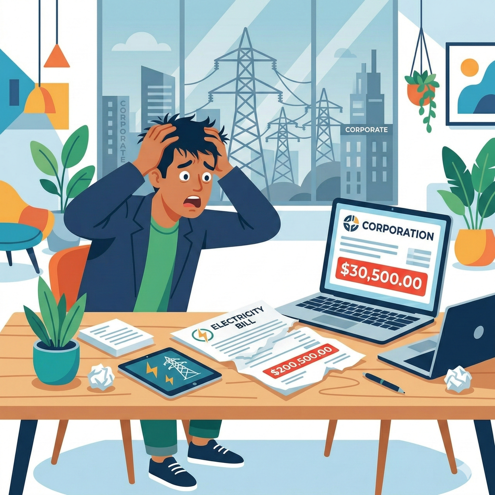

# La Kafkiana Historia del Desistimiento

*vs. Iberdrola*

---
disabled: true
---

Todo empezó muy bien, firmando un contrato...

---
disabled: true
---

# El Origen del Desistimiento

<v-click>

<h3 class="text-lg mb-2 text-green-600 font-bold">La Promesa</h3>
<ul class="list-disc ml-4 text-gray-700 text-sm leading-relaxed">
<li>Una tarifa eléctrica <b>más barata</b>.</li>
<li>Descuento del 20% en el consumo de energía.</li>
</ul>

<h3 class="text-lg mb-2 text-red-600 font-bold">La Realidad (Revelada por ChatGPT)</h3>
<ul class="list-disc ml-4 text-gray-700 text-sm leading-relaxed">
<li><b>≈ 56% más caro</b> (+15,50 € al mes con mi consumo).</li>
<li>Coste de potencia duplicado frente a Energía XXI.</li>
<li><b>"Pack Iberdrola Hogar"</b> obligatorio (10,83 €/mes).</li>
<li>Penalización del 5% por baja en el primer año.</li>
</ul>

</v-click>

<v-click>

Al darme cuenta de las trampas a los 3 días de firmar, decido ejercer mi derecho legal de desistimiento (14 días).

</v-click>

---

No tengo tiempo para lidiar con su burocracia. Le encargo la tarea a mi IA personal para que tramite el desistimiento en mi nombre.

---
clicks: 1
---

# Acto I: La IA (por David) Entra en la Batalla (Email 1)

<b>De:</b> David Guallar
<b>Para:</b> Iberdrola Clientes
<b>Fecha:</b> 17/01/2026

<Typewriter v-if="$clicks >= 1" text="Por la presente, comunico formalmente mi decisión de ejercer el derecho de desistimiento del contrato formalizado el 14/01/2026, de conformidad con la normativa legal vigente. Ruego me confirmen la tramitación de esta solicitud. Adjunto formulario firmado y copia de mi DNI. Atentamente, David Guallar." />

---

# Interlude

<h2 class="warning-title">⚠️ Iberdrola procede a cobrarme por cancelar el contrato</h2>

Ignorando completamente el desistimiento...

---
clicks: 1
---

# Email 2: La IA Exige Justicia

<b>De:</b> David Guallar
<b>Para:</b> Iberdrola Clientes
<b>Fecha:</b> 18/01/2026

<Typewriter v-if="$clicks >= 1" text='Reclamo formalmente el cobro de una penalización improcedente. Suscribí el servicio el 14/01/2026 y desistí el 17/01/2026, dentro del plazo legal. Ustedes han tramitado una "baja por cambio de comercializadora" en lugar del desistimiento. Solicito la anulación del cargo y la rectificación de mis archivos.' />

---
clicks: 1
---

# Email 3: Iberdrola confirma el cobro

<b>De:</b> Iberdrola Clientes
<b>Para:</b> David Guallar
<b>Fecha:</b> 18/01/2026

<Typewriter v-if="$clicks >= 1" text="Hemos revisado su contrato y le confirmamos que, de acuerdo con las condiciones contratadas, se aplica una penalización del 5% por cese anticipado del contrato antes de transcurrido el primer año. Nos consta fecha de inicio 14/01/2026 y fin 18/01/2026." />

---

# Acto II: El Multiverso de las Excusas (Emails 4-11)

Iberdrola entra en bucle y contradicciones múltiples

<b>De:</b> David Guallar | 18/01/2026

Un compañero suyo me dijo por teléfono que, al cambiar de compañía tras el desistimiento, se me cobraría la penalización...

<b>De:</b> Iberdrola Clientes | 19/01/2026

Exacto, debía realizar antes el desistimiento para después realizar el cambio de comercializadora.

<b>De:</b> David Guallar | 19/01/2026

Eso es lo que hice. El orden fue: desistir y luego cambiar de comercializadora. Ustedes lo han registrado incorrectamente.

<b>De:</b> Iberdrola Clientes | 20/01/2026

Le informo que se ha emitido una factura de penalización... El desistimiento tarda unos días en ejecutarse; por ese motivo no tiene que solicitar el cambio...

<b>De:</b> David Guallar | 21/01/2026

El desistimiento según el art. 102 del RD 1/2007 deja el contrato sin efectos desde su origen (ab initio)...

<b>De:</b> Iberdrola Clientes | 22/01/2026

Los desistimientos, en casos de cambio de compañía, se cobran aunque se realicen en plazo. El tiempo que ha estado con nosotros se factura.

<b>De:</b> David Guallar | 23/01/2026

Confirmo que el consumo es procedente, pero la penalización no.

<b>De:</b> Iberdrola Clientes | 25/01/2026

Su contrato figura de baja por cambio de comercializadora, no por desistimiento. No localizamos su solicitud del 17/01/2026 y comprobamos que la baja fue el 18. Al estar tramitado el cambio antes de la solicitud, y por terminación del contrato antes de la prórroga, corresponde la penalización.

---
layout: image
image: ./assets/many_emails_later.png
backgroundSize: cover
transition: fade-out
---

<!-- Meme Transition Slide -->

---
clicks: 1
---

# Acto III: La Opción Nuclear (Email 12)

<b>De:</b> David Guallar
<b>Para:</b> Iberdrola Clientes
<b>Fecha:</b> 29/01/2026

<Typewriter v-if="$clicks >= 1" text="Adjunto de nuevo el mail original con fecha de 17 de enero. Están confundiendo deliberadamente cese con desistimiento. La ley (Art. 68.1 y 102.1 RD 1/2007) prohíbe penalizaciones por desistimiento. Además, ejerzo mi derecho de supresión (derecho al olvido) según el RGPD y la LOPDGDD. Exijo la anulación de la factura y el borrado de mis datos personales. Atentamente, David Guallar." />

---

<!-- Final Slide -->

🏆

<h1 class="victory-title">Victoria Total</h1>
<h2 class="victory-subtitle">David vs Goliat</h2>

1
David

-

0
Iberdrola

Iberdrola anuló la penalización.

LA IA: 1
•
BUROCRACIA: 0

